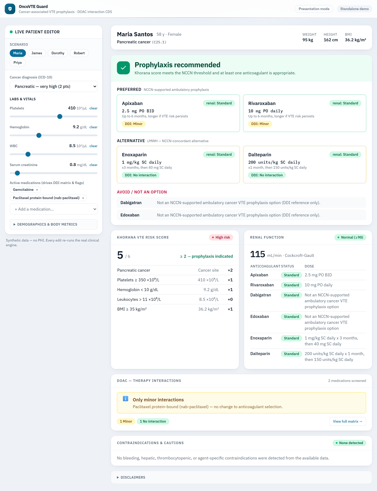
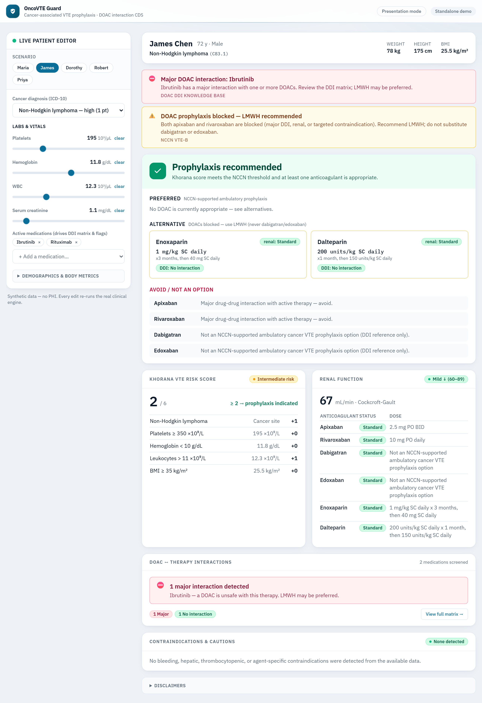
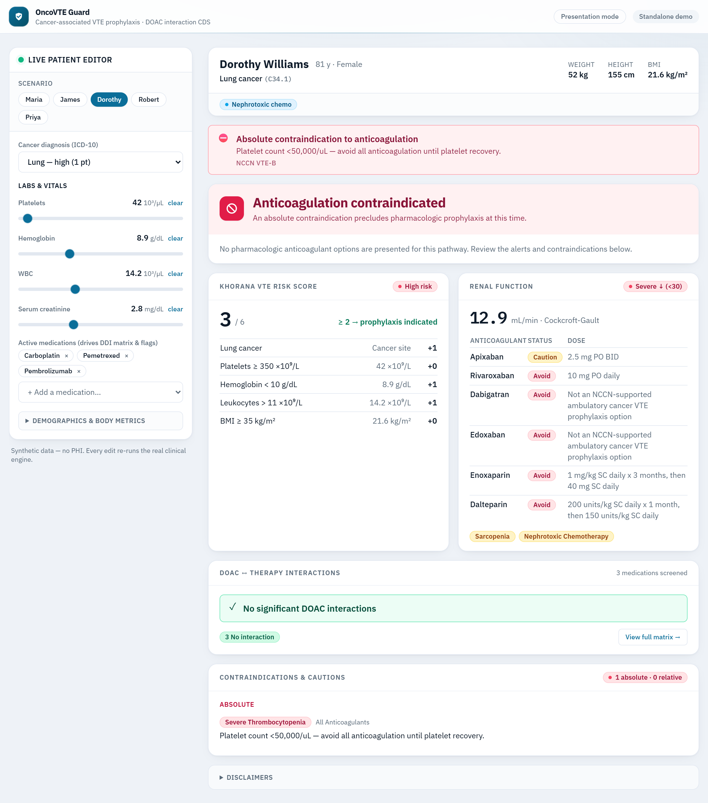
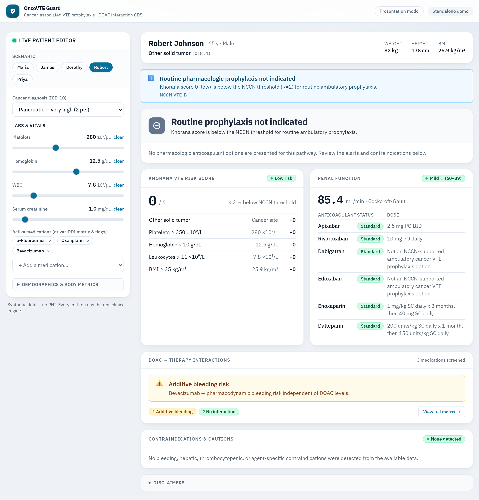
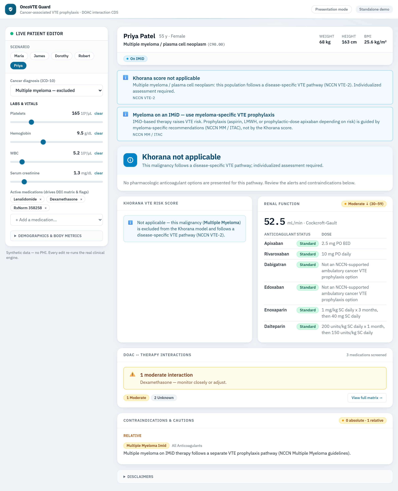

# OncoVTE Guard

**SMART-on-FHIR clinical decision support for cancer-associated VTE prophylaxis, with DOAC–chemotherapy drug–drug interaction (DDI) checking.**

_AMIA / HL7 FHIR App Competition — Student category._

**🔗 Live demo:** https://oncovte-guard.pages.dev &nbsp;·&nbsp; **SMART launch URL:** https://oncovte-guard.pages.dev/launch

OncoVTE Guard helps oncology clinicians decide whether an ambulatory cancer
patient warrants pharmacologic venous thromboembolism (VTE) prophylaxis, and —
when it does — which anticoagulant is appropriate given the patient's renal
function, active chemotherapy, contraindications, and bleeding risk. It runs as
a SMART-on-FHIR app inside an EHR and exposes the same logic as a CDS Hooks
service.

---

## Clinical basis

| Component | Source |
| --- | --- |
| Khorana VTE Risk Score (max **6**; 0 Low, 1–2 Intermediate, ≥3 High; prophylaxis at ≥2) | Khorana et al., _Blood_ 2008; NCCN Guidelines® Cancer-Associated VTE (VTE-B/VTE-C) |
| Prophylaxis agents: **apixaban 2.5 mg PO BID**, **rivaroxaban 10 mg PO daily**, LMWH alternative | NCCN VTE-B; AVERT/CASSINI trials |
| DOAC–chemotherapy interactions (P-gp / CYP3A4) | Published DOAC interaction literature; product labeling |
| Additive (pharmacodynamic) bleeding risk | AHA 2022 Scientific Statement |
| Cockcroft-Gault CrCl + renal dose thresholds | NCCN VTE-B; DOAC labeling |
| Disease-specific exclusions (myeloma, primary brain tumor, acute leukemia, MPN) | NCCN VTE-2 |

> **Decision support only.** OncoVTE Guard does not replace clinical judgment.
> All medication, laboratory, and diagnosis data must be verified against the
> source record before acting.

---

## What it does

- **Khorana scoring** from ICD-10-CM cancer site + platelets, hemoglobin/ESA,
  WBC, and BMI — with a transparent per-criterion breakdown.
- **DOAC ↔ therapy interaction matrix** across all four DOACs (apixaban,
  rivaroxaban, dabigatran, edoxaban) for every active medication, with
  mechanism and management for each cell.
- **Renal dosing** via Cockcroft-Gault, with per-anticoagulant standard /
  caution / avoid guidance and nephrotoxic-chemo + low-weight warnings.
- **Contraindication screening** (bleeding, severe thrombocytopenia,
  antiphospholipid syndrome, HIT, hepatic impairment, GI/brain tumor,
  myeloma + IMiD, concurrent antiplatelet, low weight) — each tagged with the
  anticoagulants it applies to.
- **Synthesized recommendation**: preferred DOAC(s), LMWH alternative, an
  explicit "avoid / not an option" list, and ranked clinical alerts.
- **Stale-lab guarding**: values older than 30 days are flagged before they
  drive a decision.

### Key clinical guardrails (verified by tests)

- **Only apixaban and rivaroxaban** are ever presented as prophylaxis options.
  Dabigatran and edoxaban are interaction references only — if **both** DOACs
  are blocked, the app falls back to **LMWH, never** to dabigatran/edoxaban.
- A global "contraindicated" verdict is reached **only** for a _universal_
  absolute contraindication; targeted ones (e.g. HIT blocks LMWH but leaves the
  DOACs preferred) just remove the affected agents.

---

## Demonstration cases (synthetic, no PHI)

| # | Patient | Pathway demonstrated |
| --- | --- | --- |
| 1 | Maria Santos | Pancreatic ca, Khorana **5 High** → apixaban + rivaroxaban; normal renal; nab-paclitaxel minor DDI |
| 2 | James Chen | Lymphoma, Khorana **2** but **ibrutinib major DDI** → both DOACs blocked → **LMWH** (never dabi/edox) |
| 3 | Dorothy Williams | Lung ca, Khorana **3** but **platelets 42 K** → absolute contraindication; CrCl **12.9** severe |
| 4 | Robert Johnson | Colon ca, Khorana **0** → not indicated; **stale labs**; bevacizumab additive-bleeding flag |
| 5 | Priya Patel | **Multiple myeloma** → Khorana excluded (disease-specific pathway); on IMiD |

<p align="center">
  
  
  
  
  
</p>

<p align="center"><sub>Five distinct decision states: recommend · LMWH fallback · contraindicated · not indicated · excluded.</sub></p>

---

## Architecture

```
src/
  core/         Clinical engines (pure, framework-free, fully unit-tested)
                khorana-engine · ddi-checker · renal-dosing ·
                contraindications · stale-lab · recommendation (orchestrator)
  data/         Knowledge bases (DDI KB, ICD-10 map, LOINC, RxNorm)
  types/        Shared domain contracts
  fhir/         FHIR R4 → PatientData parsing; SMART launch; live client;
                standalone synthetic loader
  cds-hooks/    Discovery, prefetch adapter, card builder, Express server
  components/   React dashboard (banner, recommendation, Khorana, renal,
                DDI matrix, contraindications, alerts)
  ui/           Presentation helpers (severity ↔ color/label)
synthetic-patients/   Five FHIR R4 collection bundles
```

The clinical engines are deliberately UI- and transport-agnostic. The SMART
app, the standalone demo, and the CDS Hooks service all converge on one seam —
`assemblePatientData()` → `generateRecommendation()` — so every surface produces
identical clinical output.

---

## Running it

Requires Node 18+.

```bash
npm install

npm run dev          # Vite dev server (standalone demo at http://localhost:5173)
npm run build        # type-check + production build to dist/
npm run preview      # serve the production build
npm test             # full Vitest suite
npm run typecheck    # tsc --noEmit
npm run cds-server   # CDS Hooks service at http://localhost:3000/cds-services
```

### Standalone vs. SMART launch

- **Standalone demo** — open the app directly; pick any of the five synthetic
  patients from the left rail. No EHR sandbox required.
- **SMART launch** — register the app with launch URL `…/launch.html`, redirect
  URL `…/index.html`, and scopes:

  ```
  launch patient/Patient.read patient/Condition.read
  patient/Observation.read patient/MedicationRequest.read openid fhirUser
  ```

  `launch.html` performs the OAuth2 handshake; the app then calls
  `FHIR.oauth2.ready()` and fetches live data. The required FHIR interactions
  are documented in [`public/capability-statement.json`](public/capability-statement.json).

### CDS Hooks

`npm run cds-server` exposes:

| Method | Path | Hook | Purpose |
| --- | --- | --- | --- |
| GET | `/cds-services` | — | Discovery document |
| POST | `/cds-services/oncovte-prophylaxis` | `patient-view` | Full prophylaxis assessment cards |
| POST | `/cds-services/oncovte-ddi-check` | `order-select` | Real-time DOAC interaction cards for the order being composed |

Both services declare prefetch templates so a conformant EHR delivers the FHIR
resources inline.

---

## Testing

`npm test` runs **110 tests** across the clinical engines, the FHIR parsing
layer, the end-to-end synthetic-patient pathways, and the CDS Hooks card
builder. The engine suites encode the competition's authoritative
[errata contract](plan/errata-contract-reconciliation.md) (e.g. Khorana max 6,
the apixaban/rivaroxaban-only rule, and appliesTo-aware contraindications) and
the published Khorana/NCCN VTE-C risk tiering (0 Low, 1–2 Intermediate, ≥3
High). `npm run typecheck` is clean under TypeScript `strict`.

---

## Disclaimers

OncoVTE Guard provides clinical decision support only and does not replace
clinical judgment. Recommendations are based on NCCN VTE-B guidance and
published DOAC drug-interaction literature; verify against the most current
guidelines. All data shown in the demo is synthetic and contains no PHI.
